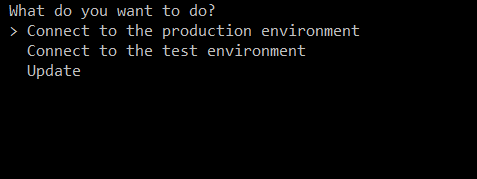

# go-choice


A very simple library for interactively selecting an option on a terminal 


## Usage

```go
package main

import (
    "fmt"

    "github.com/TwiN/go-choice"
)

func main() {
    choice, index, err := gochoice.Pick(
        "What do you want to do?\nPick:",
        []string{
            "Connect to the production environment",
            "Connect to the test environment",
            "Update",
        },
    )
    if err != nil {
        fmt.Println("You didn't select anything!")
    } else {
        fmt.Printf("You have selected: '%s', which is the index %d\n", choice, index)
    }
}
```



You can customize the experience further by appending options at the end of the `Pick` function:

```go
package main

import (
    "fmt"

    "github.com/TwiN/go-choice"
)

func main() {
    choice, index, err := gochoice.Pick(
        "What do you want to do?\nPick:",
        []string{
            "Connect to the production environment",
            "Connect to the test environment",
            "Update",
        },
        gochoice.OptionBackgroundColor(gochoice.Black), 
        gochoice.OptionTextColor(gochoice.White),
        gochoice.OptionSelectedTextColor(gochoice.Red),
        gochoice.OptionSelectedTextBold(),
    )
    if err != nil {
        fmt.Println("You didn't select anything!")
    } else {
        fmt.Printf("You have selected: '%s', which is the index %d\n", choice, index)
    }
}
```

